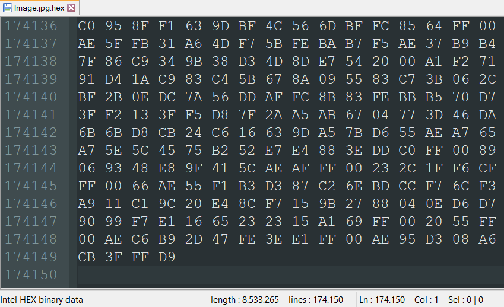

# HexFileConverter

<h3>Why HexFileConverter?</h3>
I needed to convert a hex file (saved in a <a href="https://github.com/LucaBarile/HexFileConverter#hex-file-format" target="_blank" rel="noopener noreferrer">particular format</a>) in order to develop <a href="https://github.com/LucaBarile/ZDI-CAN-16318/tree/main/ARB_RW" target="_blank" rel="noopener noreferrer">my ARB_RW exploit</a> for <a href="https://github.com/LucaBarile/ZDI-CAN-16318" target="_blank" rel="noopener noreferrer">ZDI-CAN-16318</a>. 
(The exploit is quite interesting; read <a href="https://lucabarile.github.io/Blog/ZDI-CAN-16318/arb_rw/index.html" target="_blank" rel="noopener noreferrer">my report</a> if you have nothing better to do &#128580;). 
After developing the code to convert a hex file to its original format I thought I’d also implement the code to perform the reverse conversion as well. 
HexFileConverter was born putting everything together in one program. 

<h3>What is it for?</h3>
Allows you to convert a file of any type to hexadecimal format (and vice versa). 

<h3>Usage</h3>
First of all download <a href="https://github.com/LucaBarile/HexFileConverter/raw/main/HexFileConverter/HexFileConverter/bin/Release/HexFileConverter.exe" target="_blank" rel="noopener noreferrer">here</a> HexFileConverter. 
 
To convert a file of any type (e.g. <code>foo.txt</code>) to hex format: 
<code>HexFileConverter.exe foo.txt</code> 
The <code>foo.txt.hex</code> file will be generated. 
 
To convert a file from hex format (e.g. <code>foo.txt.hex</code>) to its original format (txt): 
<code>HexFileConverter.exe foo.txt.hex</code> 
The <code>foo.txt</code> file will be generated. 
 
Note: 
In this case the file you want to convert must be located in the same folder as <code>HexFileConverter.exe</code> 
If not, you must specify the entire path of the file to convert (e.g. <code>C:\...\Desktop\foo.txt</code>). 
 

<h3>Hex file format</h3>
To convert a hex file successfully, it must be formatted as follows: 
- Each hexadecimal number must be separated by a space. 
- There must be at most 16 hexadecimal numbers in a row. 
- The letters of a hexadecimal number can be either uppercase or lowercase. 
- After the last hexadecimal number there must be a newline. 
- The newline characters must be <a href="https://stackoverflow.com/questions/3986093/in-c-whats-the-difference-between-n-and-r-n" target="_blank" rel="noopener noreferrer">\r\n</a> 
- The hexadecimal file name must be fileName.OriginalFileExtension.hex (e.g. foo.txt.hex). 
 

If your hex file is not formatted as shown in the previous image, you have two choices: 
<ol>
  <li>
    You have also the original file, so you can throw away your unformatted hex file and use <code>HexFileConverter.exe</code> to convert it to the correct hex format. 
  </li>
  <li>
    You don't have the original file, so you must convert it manually (small file) to the correct hex format or by creating a tool that does it for you (large file (sad story &#128549;)).
  </li>
</ol>
<h3>Oh?! Is that a flying unicorn?! &#128562;</h3>
If you liked HexFileConverter, what do you think about buying me a unicorn? &#129412; 
<a href="https://www.buymeacoffee.com/LucaBarile" target="_blank" rel="noopener noreferrer">Here</a> you can buy me a unicorn.
